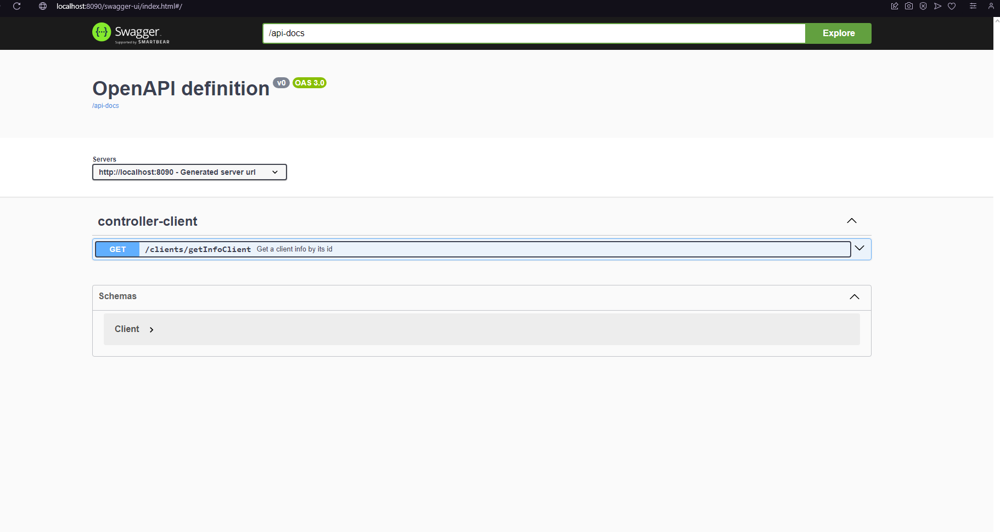
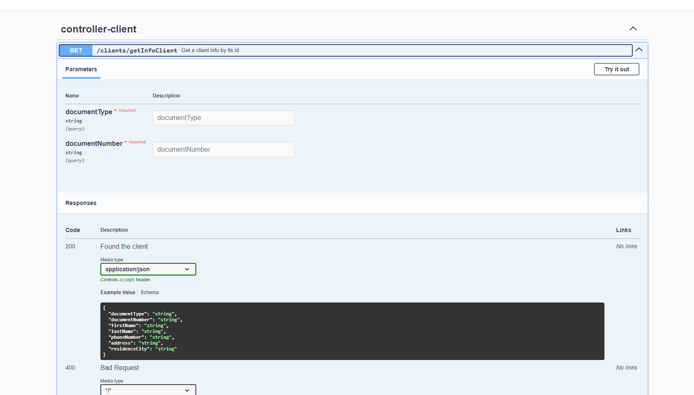

# 💫 About Me:
🔭I am working in projects with java (microservices among others), . 👯 I can collaborate with projects from scratch and support with java, plsql, oracle among others 🤝 I’m looking for help with freelance work or others projects in microservices with Java or that have similarity 🌱 I’m currently learning react, nodejs 💬 Ask me about Java, jwt, JPA, Hibernate, SQL, PLSQL, MongoDb and others

## 🌐 Socials:
 

# 💻 Tech Stack:
                                         
# 📊 GitHub Stats:
 
 

### 😂 Random Dev Meme

---

  ## 💰 You can help me by Donating
   

  
<!-- Proudly created with GPRM ( https://gprm.itsvg.in ) -->

## 🔨 Steaps by execute and testing project

😃 Import project (PeriploSoft) with STS or Intellij, you must be have has JDK 17 installed in your machine 😊 
😬 Run to SpringBoot application  
📝 Copy and paste the following URL (https://cloudy-firefly-30794.postman.co/workspace/PruebaCeiba~62add125-25a5-4cf7-973b-fd50fee26e6d/request/8889996-ede0732a-a311-4b6d-a465-cc7aac88b897?action=share&source=copy-link&creator=8889996&ctx=documentation) to postman app 😉 
😯 Run test from postman and verify expected results 😯 
😱 The project also has swagger doc 😱 
👍 Swagger doc you can see it in the following url (http://localhost:8090/swagger-ui/index.html#/controller-client/getInfoClient) from any internet navegator (Chrome. Iexplorer and othes)👍  

## ❗️Important note

⚠️ The project its upload by port 8090 with the spring Boot configuration, for this reason the machine and port deploy is localhost ⚠️

# 😮 Swagger Screenshots

